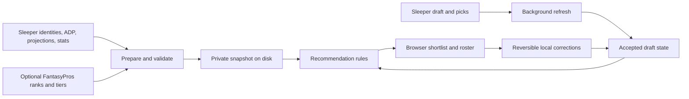

# Fantasy planning — fantasy-p55

```doc-meta
role: working
lifecycle: inflight
```

Tier: **Full**, confirmed by the operator on 2026-09-08.

Rationale: A new product with an external platform integration, uncertain data
sources, and architecture decisions requires Full planning.

Planning epic: `fantasy-p55` tracks the personal Sleeper fantasy football
assistant and its approved execution backlog.
Workflow: `/home/ddc/.claude/skills/abacus-plan/SKILL.md`.

Current stage: **RECORD review pending export authorization**. FRAMING, RESEARCH, and
ARCHITECTURE are approved. Earlier sections preserve their gate proposals;
architecture approval locks local delivery and the correction behavior.

Operator instruction on 2026-09-08: "no need to ask me for approval for the
remaining phases - just continue on until this plan session is complete".
This explicitly supersedes the remaining approval pauses. Required stage
deliverables, verification, reviews, commits, and handoff still apply.

## FRAMING

Status: **Approved** by the operator on 2026-09-08: "approve the framing".
Approval covers the browser presentation, stories, non-goals, success metric,
and confirmed league constraints below. The next stage is RESEARCH.
Targeted source checks below answer the operator's documentation and source
requests; they do not constitute approval or completion of the RESEARCH stage.

### Confirmed intent and constraints

- Personal fantasy football assistant for the operator, using Sleeper.
- League: **2026 Fiji**, a 14-team redraft league; season 2026.
- Scoring: half-PPR (0.5 per reception), 4 points per passing touchdown,
  -2 per interception, 0.04 per passing yard, and 0.1 per rushing/receiving yard.
- Roster: QB, 2 RB, 2 WR, TE, FLEX, K, DEF, and 4 bench slots; 1 reserve slot.
- Draft: 13-round snake, 60 seconds per pick, no configured reversal round.
- Kijuuu is draft slot **1**, with roster ID **5**. The first five overall
  selections are 1, 28, 29, 56, and 57 under the currently configured order.
- Prioritize draft assistance and fast consultation during the draft.
- The operator reported the draft is tonight, approximately nine hours away.
  Sleeper lists 2026-09-08 21:00:45 America/New_York (2026-09-09 01:00:45 UTC)
  as its scheduled start. This is a schedule, not a guarantee of actual start.
- Recommendations only. The operator makes picks in Sleeper.
- Season management remains a later product goal, outside tonight's release.
- Sleeper is the operator's only current source. They are open to other
  recommendations. No third-party subscription or purchase is authorized.
- Repository has no application code or test suite. Planning is published to
  origin/master at git@github.com:DylanDelliColli/fantasy-assistant.git; pushes
  use the existing github-personal SSH host.

### Verified league identity

Read from Sleeper on 2026-09-08 around 16:14 UTC:

| Field | Value |
| --- | --- |
| League ID | `1389330057733865472` |
| Draft ID | `1389330057733865473` |
| Username | `Kijuuu` (API canonical username `kijuuu`) |
| User ID | `1264288993504149504` |
| Roster ID | `5` |
| Draft slot | `1` |
| State | `pre_draft`; no picks returned |
| Operator roster | No players or keepers assigned |

Evidence: [league](https://api.sleeper.app/v1/league/1389330057733865472),
[drafts](https://api.sleeper.app/v1/league/1389330057733865472/drafts),
[user](https://api.sleeper.app/v1/user/Kijuuu),
[rosters](https://api.sleeper.app/v1/league/1389330057733865472/rosters), and
[picks](https://api.sleeper.app/v1/draft/1389330057733865473/picks).

Integration detail for RESEARCH: roster ID 5 is not draft slot 1. The league
record's `settings.draft_rounds` is 3 while the active draft's `settings.rounds`
is 13. Preserve this distinction when selecting fields and defining tests.

### Narrowest valuable release

A personal draft assistant that loads the actual league rules and draft state,
then presents three available pick candidates with short, source-grounded
reasons reflecting player value and the operator's drafted roster. Picked
players disappear as the draft updates. The operator can see when data was
last refreshed and retain the last usable board if a refresh fails. Show the
operator's next two picks and account for consecutive selections at the turn.

Approved presentation: a browser page kept beside Sleeper, showing the shortlist
without requiring a new question each turn.

### User stories and acceptance scenarios

- **US-DRAFT-01 — Prepare:** Review a league-specific draft plan before the
  draft. Given the actual scoring, roster requirements, and draft position,
  show a concise strategy and identify the data supporting it; do not silently
  substitute assumed league settings.
- **US-DRAFT-02 — Consult during the draft:** See three available candidates,
  or all eligible candidates if fewer remain, with concise reasons. After
  another team drafts a candidate and that pick is observed, remove that
  player from the shortlist and incorporate the operator's own completed picks.
  At picks 28 and 29, retain the next-pick context and reconsider the second
  selection after the first is recorded. Do not equate roster ID with slot.
- **US-DRAFT-03 — Understand freshness:** See the current draft state and data
  update times. A failed refresh preserves the previous usable board with an
  explicit stale-data indication rather than presenting it as current.
- **US-SEASON-01 — Manage the team:** Support season-long decisions later.
  Retained as product direction; no season-management implementation is in
  tonight's approved scope.

### Non-goals

Automated picks or transactions; weekly lineups, waivers, and trade advice for
tonight; other platforms or sports; multi-user accounts; multi-league dashboards;
an independent projection model. Additional draft formats beyond the operator's
actual league require a later scope decision.

### One epic product success metric

Before the real draft, the operator can identify a preferred available player
within 10 seconds of consulting the assistant in each of three consecutive
rehearsed turns at picks 1, 28, and 29, using their actual league configuration
and updated draft snapshots. Rehearsal must include another manager taking a
previously recommended player. This is a proposed usability target, not a
measured result or a promise
about Sleeper's upstream publication latency.

### Preliminary source checks requested by the operator

Checked 2026-09-08; final source and import decisions remain open.

- [Sleeper API](https://docs.sleeper.com/): documented read-only access needs no
  API token and includes league settings, draft metadata, picks, and player
  identifiers. The documented surface does not specify a draft-ranking feed;
  ranking quality is a separate dependency to resolve.
- [FantasyPros API](https://www.fantasypros.com/api-data/): offers consensus
  redraft rankings, tiers, ADP, and news. Its free API tier is sample data;
  production personal keys are included with a paid HOF subscription. Proposed
  source for external player-value rankings, subject to accessible current data
  and operator agreement. A current public ranking import remains unverified.
- [FantasyPros ADP](https://www.fantasypros.com/nfl/adp/overall.php): lists Sleeper
  among its source choices. A usable machine-readable Sleeper-specific import
  has not been verified.
- [Fantasy Football Calculator API](https://help.fantasyfootballcalculator.com/article/42-adp-rest-api):
  free ADP integration is documented. Following its official PPR page's JSON
  link returned a successful 2026 response with a September 1–8 data window.
  This verifies a candidate feed; the actual 14-team half-PPR variant still
  needs verification.
  Its ADP reflects mock-draft behavior, not expert player-value rankings or
  this specific Sleeper league.
- Proposed operating approach: prepare a dated data snapshot before the draft
  and refresh draft picks during it. Final update cadence, ranking import,
  player-ID matching, and degraded behavior belong in approved architecture.

### Open questions and prerequisites

- **Q6 — Consultation interface:** Resolved by framing approval: browser shortlist.
- **Q7 — Data source choice:** Sleeper is the only existing source; alternatives
  are welcome. Recommend a verified current-season ranking input, its access
  path, and any cost. Operator approval is required before committing to a paid
  dependency. Source suggestions above remain provisional. Resolving Q7 is an
  explicit RESEARCH deliverable; it does not require choosing a provider before
  framing approval and must be settled before architecture and handoff.
- **Q8 — Framing signoff:** Resolved: operator approved on 2026-09-08.

Resolved: Q1 personal draft and season assistance; Q2 remote; Q3 league identity,
settings, draft position, and scheduled start; Q4 draft first; Q5 recommendations
only.

External prerequisite beads: **none**. The verified public league/user/draft
identifiers supply the required Sleeper input. Browser framing is approved.
Obtaining a usable current ranking snapshot and validating the
14-team half-PPR ADP feed are planned research outcomes, not assumed capabilities.

### Gate status

Full remains the selected tier. FRAMING is approved; RESEARCH is authorized.
No architecture or implementation decisions are approved. Implementation
children and execution remain downstream of the required planning gates.

## RESEARCH

Status: **Approved** by the operator on 2026-09-08: "perfect. Continue on".
Approval follows the verified Sleeper ADP/statistics revision at `308192c`.
Upstream authority is
the FRAMING section approved on 2026-09-08 and committed at `5a4fb23`.

Producer: the default researcher role was supplied by the isolated
`rankings_research` subagent for sources, while the orchestrator verified
Sleeper integration and assembled this section. Research bead `fantasy-p55.1`
records the source investigation, probe commands, and detailed mapping audit.
The parent reran its no-network audit and independently checked that the top
400 matches are unique existing Sleeper IDs.

### Recommended direction

Use **Sleeper as the primary data provider**: league settings, draft order,
picks, roster ownership, player identities/eligibility, platform ADP, season
projections, and historical player statistics. Public `.app` ADP/projection and
stats routes were verified on 2026-09-08 after the operator correctly challenged
the initial focus on the documented v1 surface.

Use a private, dated FantasyPros half-PPR ranking snapshot as a supplementary
expert opinion and source of tiers. FFC was investigated but is no longer part
of the recommended setup for tonight: verified Sleeper ADP has wider coverage
within the checked ranking pool and already uses canonical Sleeper IDs.
Prepare ADP/projections/ranking snapshots before the draft and refresh picks
during it. The precise recommendation formula remains an architecture decision.

Use deterministic, source-grounded reasons during a turn, with current roster
needs and the next two selections visible. No model service needs to answer
before the shortlist can appear. A small local browser app is the proposed
delivery path, subject to the operator's local-versus-hosted answer.

Treat draft sync as best effort with a visible last successful check, observed
pick count, and reversible local controls for a player already taken while the
feed catches up. These controls affect this assistant only. The exact state
reconciliation and controls are proposed for the architecture gate.

### Evidence and implications

| Finding | Verified evidence | Implication / story |
| --- | --- | --- |
| Current expert ranking input is accessible | Public [half-PPR page](https://www.fantasypros.com/nfl/rankings/half-point-ppr-cheatsheets.php) returned HTML with JSON in `var ecrData`: year 2026, week 0, scoring HALF, 978 unique players, 134 experts, tiers 1–16. Provider update/check timestamp: 2026-09-08 16:12:41 UTC. | A no-login page snapshot is technically available for US-DRAFT-01/02. It is not a supported API contract; validate before replacing a usable snapshot. |
| Expert update times vary | FantasyPros describes its latest-update display as a check for revised rankings; individual expert timestamps differ. | Record source update/check and fetch times separately. Do not claim all expert opinions or injury news are current to the fetch second (US-DRAFT-03). |
| Canonical ID matching is feasible | Top 400 ECR players map uniquely to active Sleeper entries: 110 RB, 142 WR, 59 TE, 43 QB, 25 DEF, 21 K. Parent checked uniqueness. All 38 source K and 32 DEF map across the full list. | Coverage comfortably exceeds the 182-pick draft. Include kicker/defense coverage when validating US-DRAFT-02, not merely the first 200 overall ranks. |
| Full source coverage has limits | 970/978 ECR rows map; eight unresolved entries begin at rank 489. One matched entry outside the top 400 is inactive. | Quarantine unresolved/ambiguous identities and apply eligibility checks; never guess a Sleeper ID or silently present an unranked player as ranked. |
| FFC alternative is available but incomplete | The official [14-team half-PPR feed](https://fantasyfootballcalculator.com/api/v1/adp/half-ppr?position=all&teams=14&year=2026) returned 209 unique players and a September 3–8 window, 1,837 source mocks, source length 15 rounds. All 209 map uniquely; 178 of ECR's top 200 have ADP. | Retained as researched alternative; superseded by Sleeper ADP in the recommendation below. |
| Team-specific ADP calibration is unproven | One teams=12 control returned identical numeric ADP/distribution statistics; 197 formatted round strings differed. | Report market ADP, not a claimed 14-team probability of surviving until a later pick. This may reflect source methodology; it is not established as a bug. |
| Sleeper identity and order are explicit | Current draft detail includes `draft_order[user_id]=1` and `slot_to_roster_id["1"]=5`. Draft `rounds=13`; league `draft_rounds=3` is a different field. No traded picks were returned. | Use active draft metadata and roster mapping. Verified operator picks: 1,28,29,56,57,84,85,112,113,140,141,168,169 (US-DRAFT-01/02). |
| Player eligibility needs the fantasy field | Sleeper's Travis Hunter entry has primary `position=DB` but `fantasy_positions=[DB,WR]`. The map has 32 team defenses and 12,226 entries overall. | Match and filter by fantasy eligibility, not primary position alone. `active` is not evidence of health. |
| Polling is possible; freshness is not guaranteed | Supplied-league reads all returned HTTP 200 with wildcard CORS. In pre_draft, draft/picks headers advertised `s-maxage=30`, `stale-while-revalidate=300`; current picks were empty. | A fast poll or HTTP 200 does not prove the latest pick is visible. Distinguish last check from feed freshness and offer a local correction path (US-DRAFT-03). |
| Player map should be cached | One full response was 14,651,561 bytes, 12,226 entries, received in 1.787 seconds. [Sleeper docs](https://docs.sleeper.com/) request infrequent player-map downloads, normally at most daily. | Cache and normalize at preparation time, not once per pick or render. Single-request timings are observations, not performance guarantees. |

### Sleeper ADP and statistics verification — 2026-09-08 revision

The orchestrator performed this operator-requested follow-up directly. The
initial research correctly identified Sleeper as the state/identity source but
did not examine its ADP and stats routes; source selection is revised here.
The `.com` projection route returned 403. Ordinary unauthenticated GETs to the
following `.app` routes returned HTTP 200 with valid JSON at about 16:42 UTC:

| Resource | Verified route and response | Proposed role |
| --- | --- | --- |
| 2026 season projections and ADP | [Expanded projection response](https://api.sleeper.app/projections/nfl/2026?season_type=regular): 9,419 rows, all season 2026 and all player IDs present in the cached player map. Fields include `stats.adp_half_ppr`, other scoring-format ADPs, `stats.pts_half_ppr`, raw projected stats, and per-row `updated_at`. | Primary platform ADP and projection context. |
| Compact 2026 projections | [ID-keyed response](https://api.sleeper.app/v1/projections/nfl/regular/2026): 9,419 entries and the same examined stat values, without the expanded row timestamps. | Smaller possible import representation; provenance handling must be explicit. |
| 2025 actual statistics | [Season stats response](https://api.sleeper.app/stats/nfl/2025?season_type=regular): 8,248 rows with actual passing, rushing, receiving, fantasy points, and other stats where applicable. | Historical context; distinct from 2026 projections. No season-management feature is added to tonight's scope. |

Coverage audit against the existing FantasyPros-to-Sleeper matches:

- All top 400 matched players have `adp_half_ppr` strictly between 0 and 999.
- All top 200 and 394 of the top 400 have positive `pts_half_ppr` projections.
- Across all 9,419 projection rows, 2,041 have non-sentinel positive half-PPR
  ADP. The value 999 appears on 7,378 rows; normalize it as unavailable for this
  draft rather than a precise market estimate.
- There are 1,411 rows containing `pts_half_ppr`, 1,409 positive. Presence of
  an ADP-only row does not establish a usable projection.
- Expanded-row update timestamps range from 2026-09-08 07:50:49.308 to
  07:51:08.328 UTC. Preserve these alongside the fetch time; a successful
  fetch does not make the underlying projections newly updated.
- Observed `gp` values differ in meaning or scale: offensive examples carry
  18 and a defense example carries 1. Do not derive per-game projections from
  this field without verifying semantics. Treat `pts_half_ppr` as provider
  scoring context, not proof of a total computed under every custom league rule.
- Stats, projections, ADP, and draft value are different quantities. Do not
  sort all positions by raw projected points and call it a draft recommendation.

These ADP/stat routes are **not listed in the linked official API documentation**.
Their verified availability is stronger than an assumption of absence, but does
not supply a documented stable contract. Validate fields, season, IDs, sentinels,
coverage, and timestamps on import; preserve the last usable snapshot on failure.
The web reader rejected these URLs even though direct HTTP requests succeeded;
that was a tool limitation, not endpoint unavailability.

Temporary raw evidence: /tmp/fantasy-season-projections-app.json,
/tmp/fantasy-season-projections-v1.json, and /tmp/fantasy-season-stats-app.json.
Reproduce using ordinary GETs to the three exact URLs above. Do not publish raw
source data in Git. No extra player-map download was performed.

### Access, prior art, and alternatives

The researched supplementary ranking route is one personal copy of the public page,
stored locally with attribution and provenance. Keep raw provider pages/data out
of Git and public assets; [FantasyPros terms](https://www.fantasypros.com/about/legal/)
describe a personal-copy exception and do not establish redistribution rights.
Do not assume a free CSV export merely because the page contains a CSV button.

The official [FantasyPros API page](https://www.fantasypros.com/api-data/) says
free REST keys serve sample data; personal production access comes with HOF.
No subscription is required by the recommended public-snapshot route. A separate
official [MCP tool guide](https://support.fantasypros.com/hc/en-us/articles/55238312588571-What-tools-are-available-in-the-FantasyPros-MCP-Server)
lists ECR/ADP with a free account, but its OAuth connection and data import were
not tested here. Neither paid REST nor MCP setup is a dependency for tonight.

FantasyPros' [Draft Assistant](https://draftwizard.fantasypros.com/football/draft-assistant/)
is relevant prior art: league context, taken-player tracking, and expert
recommendations form the established workflow. It is an alternative product,
not an integration assumed by this plan. [ECR methodology](https://support.fantasypros.com/hc/en-us/articles/115001219327-What-is-ECR-Expert-Consensus-Rankings-and-how-do-you-calculate-it)
aggregates expert judgments; ECR rank is ordinal evidence, not a projected-points
difference. FFC says its ADP comes from mocks, and its own ranking page derives
rankings from that ADP; that page is not an independent expert-value source.

### Integration constraints and failure cases

- Store Sleeper league/user/draft IDs as strings. Normalize roster/slot keys
  deliberately rather than relying on number coercion.
- Identity matching should normalize punctuation, diacritics, and suffixes,
  then use fantasy position and team to disambiguate. Map DEF by team and
  normalize PK/K, DST/DEF, and team aliases. No fuzzy automatic join.
- Two reviewed aliases are needed within ECR's top 400: FantasyPros 18226
  (Hollywood Brown) to Sleeper 5848 (Marquise Brown), and FantasyPros 24901
  (Bam Knight) to Sleeper 8122 (Zonovan Knight). Source page filenames and
  Sleeper name/team/position corroborate them. Retain original IDs/names.
- Use ECR/tier, roster requirements, and remaining picks for explainable
  recommendations, supplemented by Sleeper ADP and projection context. ADP can
  inform a reach or value observation; it does not
  justify survival percentages. Injury status/news age must be visible where
  relevant, with no claim that a null injury field means fully healthy.
- Poll picks on a bounded cadence; five seconds is a candidate, not a locked
  setting. Stop overlapping requests and back off on errors. Polling faster
  does not eliminate upstream caching. Rank input can remain usable offline.
- Rebuild availability from full pick snapshots, incorporating local pending
  corrections without issuing Sleeper mutations. Commissioner undo, reconnect,
  stale responses, and a previously selected candidate taken by another team
  require explicit reconciliation rules in ARCHITECTURE.
- Current live evidence covers pre_draft and an empty pick list only. Synthetic
  fixtures must cover draft progression, rollback, errors, and reconnect.
  Automatic approval review rejected a historical-league/invalid-ID probe as
  outside the supplied league scope; it did not run and was not retried.
- No schema change or shared Supabase dependency is indicated for tonight's
  single-user snapshot and draft-state needs. Storage/deployment are proposed
  choices, not locked architecture.

### Reproducible research checks

Source retrieval used ordinary unauthenticated GETs. Future workers can repeat:

```sh
curl --fail --silent --show-error --location --max-time 30 --output /tmp/fantasypros-half-ppr.html https://www.fantasypros.com/nfl/rankings/half-point-ppr-cheatsheets.php
curl --fail --silent --show-error --location --max-time 30 --output /tmp/ffc-half-ppr-14.json 'https://fantasyfootballcalculator.com/api/v1/adp/half-ppr?position=all&teams=14&year=2026'
curl --fail --silent --show-error --dump-header /tmp/draft-headers.txt --output /tmp/draft.json https://api.sleeper.app/v1/draft/1389330057733865473
curl --fail --silent --show-error --dump-header /tmp/pick-headers.txt --output /tmp/picks.json https://api.sleeper.app/v1/draft/1389330057733865473/picks
```

Parse the JSON value after the `var ecrData = ` marker as JSON, never evaluate
page JavaScript. Assert year/scoring/week, unique IDs, finite ranks, coverage,
and source metadata. Join against a cached Sleeper player map using the rules
above and report unmatched rows. Inspect headers separately from body timing.

Temporary evidence at /tmp/fantasy-rankings-source-summary.json and
/tmp/fantasy-rankings-source-probe.py was independently reviewed and rerun.
Those files are conveniences, not a durable dependency: the URLs, input schemas,
matching rules, counts, and caveats in this record and research bead are the
reproducible contract. Raw datasets were not committed.

### Provisional module fingerprints

All paths below are **provisional new files**, not existing symbols. The
repository currently contains only tracker/corpus/planning files, as verified
with `rg --files --hidden -g '!.git/**'`. Local runtime checks returned Node
v24.13.1 and npm 11.9.0. Node offers built-in
[HTTP](https://nodejs.org/docs/latest-v24.x/api/http.html) and
[test](https://nodejs.org/docs/latest-v24.x/api/test.html) modules. Plain ESM and
a small browser client are a viable low-dependency candidate; framework and
module boundaries will be locked at ARCHITECTURE.

| Candidate area | Provisional write footprint | Evidence/seam and story | Confidence |
| --- | --- | --- | --- |
| Source preparation and identity | scripts/prepare-data.mjs; src/data/sources.mjs; src/data/identity.mjs; src/data/snapshot.mjs; tests/unit/sources.test.mjs; tests/unit/identity.test.mjs; tests/integration/source-import.test.mjs; .gitignore | Sleeper ADP/projection/stat JSON, supplementary ECR HTML, sentinel/coverage checks, 400-player join, private atomic snapshot; US-DRAFT-01/03 | High need; medium boundaries |
| Sleeper adapter and draft state | src/sleeper/client.mjs; src/draft/state.mjs; tests/unit/draft-state.test.mjs; tests/integration/draft-sync.test.mjs | ID/order/round differences, full pick snapshots, stale/manual reconciliation; US-DRAFT-02/03 | High |
| Recommendation rules | src/draft/recommend.mjs; src/draft/roster.mjs; tests/unit/recommend.test.mjs | Ranked available candidates, nullable ADP, positional fit and 1/28/29 turns; US-DRAFT-01/02 | High need; scoring approach provisional |
| Browser and serving | src/server.mjs; web/index.html; web/app.mjs; web/styles.css; tests/integration/app.test.mjs | Approved browser workflow and deployment answer; real HTTP/client composition; all draft stories | Medium |
| Shared setup and fixture contracts | package.json; src/contracts.mjs; tests/fixtures/sleeper.mjs; tests/fixtures/rankings.mjs; README.md | No existing application surface; common snapshot/board contracts and startup command | High need; medium paths |

### Provisional bundle groups

Candidate group **draft-core**: source preparation, draft state, recommendation
rules, and initial server wiring are likely to share src/contracts.mjs,
package.json, and synthetic fixtures. If those write overlaps survive
architecture, one lane and one PR for the small core avoids repeated contract
edits and merge sequencing. This is a candidate grouping, not a dispatch claim.

Candidate group **draft-ui**: web/app.mjs, web/index.html, styles, and the browser
integration test likely change together. It can be a separate lane only after
the board contract/server routes are stable and its write footprint excludes
core files; otherwise merge it into draft-core. ARCHITECTURE and DECOMPOSITION
must re-derive every path and discard stale groups.

### Operator decisions and gate

- **Q7:** Resolved by research approval: Sleeper is the primary provider for
  state, identity, ADP, projections, and historical stats; a private FantasyPros
  half-PPR snapshot supplies optional supplementary rankings and tiers. FFC is
  removed from tonight's setup; no paid API dependency is proposed.
- **Q9:** Local browser on this computer, or a hosted link for another device?
  Local delivery is recommended for tonight; the operator's answer is pending.
- **Q10:** Research approval carries forward the proposed reversible local
  correction fallback. Its exact controls and reconciliation rules will be
  presented for architecture approval. It never submits picks to Sleeper.
- **Q11:** Resolved: research approved on 2026-09-08; ARCHITECTURE authorized.

No new application code was written. Research verifies source feasibility, not
the completed application's performance or a live-draft freshness guarantee.

## ARCHITECTURE

Status: **Approved** by the operator on 2026-09-08: "approved". Approval covers
the proposal committed at `50973fe`, including local delivery (Q9), correction
behavior (Q10), and the architecture gate (Q12). Upstream:
FRAMING approved at `5a4fb23`; revised RESEARCH at `308192c` approved by
"perfect. Continue on" on 2026-09-08. This section specifies the design to
lock at this gate. No application implementation or TEST-STRATEGY has started.

Producer substitution: the orchestrator produced this section inline under
the abacus-plan substitution rule. Gaudi's existing-tree review requires
implementation children; this Full workflow creates those in DECOMPOSITION.
Its new-feature mode is explicitly unimplemented. Its interface and tradeoff
guidance informed this review, but this is not a completed Gaudi epic-mode
audit. The workflow mismatch was captured with jot.

### Decision summary and delivery assumption

Build a single-user Node 24 application with a plain browser page. One local
process prepares and retains source data, checks Sleeper in the background,
and computes recommendations in memory. The browser displays one board from
that process. A recommendation never waits for a provider fetch or a model
response. Use ordinary JavaScript ESM, built-in HTTP and filesystem support,
and no production dependency for the initial runtime. Development dependencies
for real browser verification belong in TEST-STRATEGY.

**Q9 remains an explicit operator choice:** the proposed delivery is
`http://127.0.0.1:3000` on this computer. The preference was asked asynchronously
again when architecture began. This proposal makes that local deployment
reviewable; approval of this architecture explicitly confirms it. A hosted
link would change storage, access control, and source delivery, and requires
revision of this section before approval. Silence is not approval.

One preparation command, `npm run prepare`, uses the supplied league and user
as defaults and writes a validated private snapshot. `npm start` opens the
serving process; README gives the browser URL and how to keep the computer
awake during the draft. No database, Supabase migration, account system,
subscription, cloud deployment, or Sleeper credential is required by this
local design. Historical stats support a player detail view only; weekly
management remains outside tonight's release.



### Source contract and preparation

Sleeper supplies every canonical player ID and the required league/draft
state. Use the expanded 2026 projection response verified in RESEARCH so each
ADP/projection value keeps its row update time. Use the 2025 actual-stat
response for optional historical context. The compact projection response and
FFC are not part of the initial importer. ECR is optional supplementary draft
opinion, not an identity authority or a requirement to start the assistant.

`prepareData(options) -> Promise<Snapshot>` owns retrieval, normalization,
validation, and publication. It either publishes a complete valid snapshot or
leaves the preceding snapshot intact. Inputs include the league/user IDs,
data directory, optional saved player-map path with its original fetch time,
and whether to include the FantasyPros personal snapshot. No browser request
performs preparation. Source URL overrides are limited to test composition;
the shipped configuration uses the verified provider routes.

Preparation invariants:

- Validate the actual league season, user ownership, active draft ID, snake
  order, round count, roster slots, scoring settings, and no traded picks or
  assigned keepers. Support this verified 14-team, 13-round configuration.
  Changed draft shape, traded picks, or keepers produces a clear unsupported
  configuration result; do not silently use the old pick schedule. Store the
  full scoring settings and a fingerprint of load-bearing configuration.
- Source season comes from the league, not the system clock or a global NFL
  season endpoint. All external IDs remain strings; roster/slot numbers must
  be validated integers. The ID-to-roster mapping must resolve Kijuuu to
  roster 5 and draft slot 1 for this prepared configuration.
- Reuse a player map fetched within 24 hours, including the already downloaded
  research map when implementing today. Record its original fetch time when
  importing it. Never refresh the full map per pick, per tab, or per restart.
- Preserve all identities for interpreting picks; automatic candidates require
  `active=true`, a current NFL team, and at least one supported fantasy
  position. DEF uses its team key and team display name. This tightens the
  research eligibility assumption: 2,040 cached rows have active status,
  a supported position, and non-sentinel ADP; 777 also have a current team.
  Six ECR top-400 matches lack a current team and are excluded from automatic
  recommendations, with the reason retained in the import report. The
  400-player identity audit remains valid; it is not the eligibility count.
- Normalize absent, non-finite, non-positive, or sentinel 999 ADP to null.
  Missing projected/actual points are null, not zero. Accept actual zero
  points as zero. Reject duplicate source IDs and wrong-season responses.
- Require at least 400 uniquely identified, current-team, active candidates
  with usable Sleeper ADP, including at least 14 QB, 42 RB, 42 WR, 14 TE,
  14 K, and 14 DEF. These are preparation coverage floors, not recommended
  roster counts. The cached response exceeds these floors. A failed required
  import preserves the prior snapshot and reports exactly which check failed.
- ECR normalization uses only the deterministic matching rules and two
  reviewed ID aliases in RESEARCH. Extract the embedded JSON object without
  executing page scripts. Require 2026/week 0/HALF data, unique IDs/ranks,
  and unique Sleeper matches for the top 400 before enabling ECR mode.
  Quarantine unresolved lower ranks. An unavailable or invalid optional ECR
  source selects an explicitly labeled Sleeper-ADP mode; it does not block
  preparation or borrow an unlabeled mixture of old and new ranks.
- Historical stats are optional and cannot invalidate usable current ADP.
  Keep the actual season, source URL, fetch time, and nullable row update
  times distinct from projection provenance. Do not infer per-game values
  from the observed inconsistent `gp` field.
- Preserve each provider's scoring label. Display `pts_half_ppr` as
  "Sleeper half-PPR projection", not an exact total under every custom league
  rule. Show actual league settings separately. Tonight's recommendations
  do not implement a new statistical projection or custom scoring model.
- Cache raw data privately under `.local/sources/`; publish the normalized
  `.local/snapshot.json` by a same-directory temporary-file rename. Exclude
  `.local/` and raw provider copies from Git and static assets. Serving routes
  expose the normalized board only. A failed refresh never deletes usable data.

`Snapshot` has `schemaVersion=1`, `snapshotId`, `preparedAt`, `config`,
`configFingerprint`, `sources`, `playersById`, `rankingMode`, and `importReport`.
Each normalized player carries identity/eligible positions/team, active and
injury fields with player-map fetch time, nullable Sleeper ADP/projection and
prior actual stats with provenance, and nullable ECR rank/tier/source ID.
Source metadata contains the URL, requested season/scoring, fetch time,
available provider update time(s), and whether validation succeeded. Numeric
values are never inferred from a missing field. A reader rejects an unsupported
schema version without rewriting the file.

### Draft state, refresh, and local correction contract

`fetchDraftSnapshot(config) -> Promise<DraftSnapshot>` requests the specific
draft's detail and complete picks list. Its result has a local request sequence,
request/check times, draft metadata, and normalized picks keyed by `pickNo`.
Normalize `roster_id` from the pick itself; if absent, use the verified
`draft_slot -> roster_id` mapping. Do not depend on `picked_by`, which the
[official pick documentation](https://docs.sleeper.com/#get-all-picks-in-a-draft)
permits to be empty. Validate identity, unique pick numbers/player IDs, legal
ranges and slots, and a contiguous sequence from pick 1. Out-of-order array
rows may be sorted; an actual gap is an invalid snapshot. Unknown player IDs
are still excluded from availability. An unknown player on the operator's
roster prevents confident roster recommendations until identity is resolved;
the available-player board and explanatory status remain usable.

Use the active draft's rounds and order, never `league.settings.draft_rounds`.
For one-based round `r` and slot `s` in `N` teams, a pick is
`(r-1)*N + (r odd ? s : N-s+1)`. With the approved mapping the user's
schedule is 1,28,29,56,57,84,85,112,113,140,141,168,169. Accepted picks and local
own-pick corrections determine which of those selections remain. Show the
first two remaining selections; a generic local "taken" marker cannot advance
the clock or change the operator roster.

`reconcileDraft(previousState, incomingSnapshot) -> DraftState` and
`applyLocalAction(state, action) -> DraftState` are pure functions: their
outputs depend only on their inputs. One session owner serializes updates,
persists them, increments a revision, and builds the new board. The UI never
implements a second roster or recommendation calculation.

| Incoming situation | Required behavior |
| --- | --- |
| Initial valid read or unchanged accepted list | Accept the initial list; for an unchanged list update check metadata only. Never label unchanged data as proof of upstream freshness. |
| Valid list extends all accepted picks without changing them | Accept the complete new list and rebuild availability and roster from it. Match and retire confirmed local corrections. |
| Earlier request completes after a later state revision | Ignore its obsolete result; it cannot overwrite an action or newer accepted fetch. |
| Fewer picks, a changed player/owner at an existing pick, or a draft-shape change | Retain the usable board and show "Sleeper board changed — review" with the difference. A non-extension may be a commissioner undo or cached older data; do not guess which. |
| User chooses "Use this Sleeper board" on a pending non-extension | Accept exactly the reviewed pending snapshot revision, rebuild the roster, and clear local corrections at/after its first changed pick. Clear unassigned taken markers because their timing is unknown. Show what was cleared. Shape changes instead require preparing again. |
| HTTP error, timeout, invalid JSON/schema, or partial/gapped snapshot | Retain accepted data and corrections; show failure and last successful check. Never replace it with an empty board. |

Local actions are visible in a compact pending-corrections list with Undo:

- **Mark taken:** `{kind: "taken", playerId}` removes an observed player from
  suggestions without assigning a pick or owner. It disappears once an
  accepted Sleeper snapshot contains that player. Undo only removes this local
  exclusion; it cannot undo an official pick.
- **Record my pick:** `{kind: "my-pick", playerId, pickNo}` requires the next
  unfilled selection in the operator's schedule, with that pick number shown
  before submission. It excludes the player, adds them to the effective own
  roster, and advances the next-two-pick display immediately. It does not fill
  gaps in the official count or assert that the user is on the clock. This
  enables advice for pick 29 immediately after locally recording pick 28.
- If an accepted extension confirms a local own-pick, retire it without
  duplicating the player. If Sleeper assigns that slot a different player or
  assigns the locally recorded player to someone else, remove the conflicting
  correction and show the specific change. Official accepted ownership wins.
  Recompute the roster from the remaining official and local selections.
- Reject duplicate player corrections, occupied own slots, non-owned or out-of-
  sequence slots, unknown IDs, and requests based on an obsolete board revision.
  "Undo" and "Use this Sleeper board" affect the assistant only.

Poll upstream every five seconds after a successful cycle; do not overlap
cycles or multiply polling per browser tab. Timeout each draft/picks request
after four seconds. Failures use 10,20,40,60-second delays, capped at 60;
honor a longer valid `Retry-After`. Manual Refresh uses the same single-flight
cycle and respects the retry deadline. A successful valid cycle resets delay.
Recheck league configuration/rosters/traded-pick assumptions at preparation,
startup, and on explicit context refresh; inspect draft metadata each cycle.
Keep checking a complete draft every 30 seconds to observe an undo/reopen.
These intervals are design choices, not measured Sleeper publication latency.

Persist accepted state and corrections together under
`.local/drafts/<draftId>/session.json`, with schema/config identity and revision.
Only one application process owns that directory; startup acquires an exclusive
process lock and refuses a second writer. Recover a stale lock only after
checking that its PID is no longer alive. On restart, load the valid persisted
board as stale and then refresh. Invalid state produces an explicit recovery
message and is not silently overwritten. Disk write failure keeps the previous
durable state and reports the failed action; never acknowledge a correction
that was not saved. Mutations and persistence are serialized in the session
owner, including responses that arrive while a user action is being saved.

### Recommendation contract

`recommend(snapshot, effectiveDraftState) -> RecommendationResult` is a pure,
deterministic calculation. Return up to three distinct candidates with evidence
and reasons; return fewer only when fewer eligible candidates remain. Do not
perform HTTP, disk access, random selection, or model inference inside it.
When roster identity/configuration is unresolved or no legal completion exists,
return a specific unavailable reason and the browseable player board instead
of pretending to have a valid personalized shortlist.

With no accepted or persisted pick snapshot, show preparation data with draft
availability marked unknown; do not assume everyone is still available. When
the operator has no remaining selections, return an empty shortlist and a
completed-draft summary. Existing roster choices that exceed assistant policy
limits do not disable unrelated candidates; apply a position cap only when
the new candidate would add another player at that capped position.

Policy version `draft-v1` is an explicit, reviewable heuristic; it is not a
learned model, a win probability, or a claim of optimal drafting:

1. Remove officially picked and locally excluded players. Require current-team
   fantasy eligibility and at least ECR or usable ADP. An injury tag is shown
   with its source age; null does not mean healthy. Do not invent injury news,
   recovery dates, or a season-long penalty from a weekly status label.
2. Assign the existing own players to starting slots with a maximum matching:
   one player can fill one slot, and FLEX accepts RB/WR/TE. Among equally large
   assignments prefer dedicated positions before FLEX, then stable slot/player
   order. Bench has four places; the reserve slot is not an extra draft pick.
   This prevents a multi-position player or FLEX from being counted twice.
3. For each candidate, simulate adding them. Reject candidates that leave more
   unfilled starting slots than remaining own selections or cannot complete
   those slots from the remaining eligible pool. Do not recommend a second K
   or DEF, or more than two QB/TE. These are assistant draft policies, not
   assertions about Sleeper's position-limit enforcement.
4. Defer a backup QB/TE while any offensive starting slot remains open. Defer
   K/DEF until the user's final two selections unless completion constraints
   force that position earlier. These groups sort after ordinary candidates;
   they remain available if needed to produce the shortlist.
5. In ECR mode, order ordinary candidates by ECR tier, then whether adding the
   player fills an empty starter, then overall ECR rank, Sleeper ADP, and stable
   player ID. A roster need may reorder a tier but cannot move a later tier
   ahead of an earlier tier except for steps 3–4. Candidates missing ECR sort
   after ranked players and then by ADP; never fabricate an expert tier.
6. In ADP-only mode, sort by groups of 12 places in the ordinal ADP order,
   starter fit within that group, exact ADP, then player ID. This small-group
   roster preference is a heuristic, visibly labeled "Sleeper ADP-based";
   the groups are not expert tiers or point-value differences.
7. Emit evidence such as "ECR 18 · tier 3", "fills your second WR slot",
   "Sleeper ADP 25.4", and "your next picks: 28, 29". Projection and prior
   actual points appear as labeled context in player details. Raw projected
   points never compare QB/WR/K draft value, and ADP never generates survival
   percentages. Missing data displays an em dash with no invented reason.

At pick 1 the actual roster is empty. After pick 1, remaining own selections
start at 28 and 29. After an official or local own-pick at 28, recompute for
29 using that player in the roster. Do not recommend the pair as independent
choices from the same unchanged state or delay recomputation until all prior
opponent picks become visible. The schedule is context, not a verified timer.

### Browser and HTTP contract

One page opens with league name, half-PPR/roster summary, observed pick count,
next two own selections, three recommendation cards, and the current own
roster. Each card has name/team/position, two short evidence-based reasons,
ADP/ECR labels as available, and any source injury tag. A searchable available
player list supports position filters, player detail, Mark taken, and Record
my pick. Refresh, corrections/Undo, source ages, and any pending board change
remain visible without hiding the shortlist. Use ordinary keyboard-operable
controls and status text; color is not the only status indicator.

The preparation view explains the same draft policy: prioritize ranked value
within roster constraints, show the long gap from 1 to 28 and consecutive
turns thereafter, and reserve room to complete starters. It does not add
mock simulation, speculative opponents, projected survival, or a chat panel.

| Route | Contract |
| --- | --- |
| `GET /api/board` | Immediately return one `BoardView` from memory with `Cache-Control: no-store`; no external fetch. Include schema version, board revision, snapshot/ranking mode, league summary, draft status, next picks, own roster, recommendations, normalized player list, source ages, last check/last change, correction list, and pending-change summary. |
| `POST /api/refresh` | Start/join the bounded refresh cycle or report its next retry time; return immediately. No per-click parallel cycle. |
| `POST /api/actions` | Validate `{expectedRevision, action}` for taken/my-pick/undo/accept-pending. Persist a valid local action and return the new board. Return 409 for obsolete revision, 422 for an invalid action, and a structured error if persistence fails. |
| `GET /`, fixed JS/CSS paths | Serve only allowlisted application assets. Never serve arbitrary filesystem paths or `.local/` contents. |

Requests with unknown routes/methods fail explicitly. Parse bounded JSON bodies;
render provider strings as text, not HTML. Bind only to loopback; reject foreign
Host/Origin on local mutations and use JSON requests from the same origin.
There is no generic provider proxy, arbitrary URL fetch route, or upstream
write route. All Sleeper requests made by this application use GET.

The browser fetches `/api/board` every second while visible, with one request
in flight, plus immediately after actions or regaining visibility. It renders
only newer board revisions and preserves the current DOM/keyboard focus when
data is unchanged. Age labels advance locally. Failed browser requests retain
the displayed board and mark connection loss. This is resilience to internet
or local connection loss while open, not a promise that a closed page can be
reopened after the local process stops.

Freshness has separate meanings: source update/fetch time, last successful
Sleeper check, last observed pick-list change, and browser connection health.
Display failure immediately, and mark the check overdue after 15 seconds
without a successful cycle. During normal checks say "Checked …; Sleeper may
lag". Do not manufacture a green "live" guarantee, infer staleness just because
no pick changed, or show a precise countdown from a scheduled start time.

### Ownership, interfaces, and tradeoffs

All paths below are planned new files. A module is a piece of code with one
owned responsibility; its interface is what its callers must know, including
errors and ordering. The ownership below keeps provider changes out of the
browser and keeps roster rules in one calculation.

| Owner and planned files | Public responsibility |
| --- | --- |
| `scripts/prepare-data.mjs`; `src/data/sources.mjs` | CLI plus `prepareData(options)`; source retrieval/normalization/reporting. |
| `src/data/identity.mjs` | `matchEcrPlayers(ecrRows, playersById)`; exact ID joins, reviewed aliases, and quarantine. |
| `src/data/snapshot.mjs` | `loadSnapshot(path)` and `writeJsonAtomic(path, value)`; schema checks and atomic private-file persistence shared by snapshot/session owners. |
| `src/sleeper/client.mjs` | `loadContext(options)` and `fetchDraftSnapshot(config)`; documented state HTTP, identifier/config normalization, timeout and response validation. |
| `src/draft/state.mjs` | `reconcileDraft`, `applyLocalAction`, `deriveEffectiveDraft`; accepted snapshots, pending changes, correction reconciliation, pick schedule. |
| `src/draft/roster.mjs`; `src/draft/recommend.mjs` | `assignRoster`, completion feasibility, and `recommend`; deterministic matching/policy/reasons. |
| `src/session.mjs` | `openSession(options) -> {getBoard, refresh, act, close}`; single owner of refresh timers, state revision, serialized persistence, lock, and board construction. |
| `src/server.mjs` | `createApp({session})`; fixed HTTP routes and static files, loopback startup and graceful shutdown. Domain decisions remain in their owners. |
| `src/contracts.mjs` | Shared JSDoc record shapes and schema/policy version constants; no second validation engine, source fetches, or omnibus utilities. |
| `web/index.html`; `web/app.mjs`; `web/styles.css` | Render `BoardView`, filters and local action requests. No independent ranking or roster logic. |
| `package.json`; `.gitignore`; `README.md` | Runtime commands, private-data exclusions, setup, data attribution, usage/recovery instructions. |

Tradeoffs proposed for approval:

- **Periodic reads instead of pushed updates:** the application asks Sleeper
  for full snapshots on a timer. This matches the verified HTTP interface and
  permits recovery from missed picks; it cannot eliminate provider caching.
- **Background network work with immediate local reads:** refreshes may take
  seconds while the last usable board remains available. This favors quick
  consultation over requiring a fresh provider response for each view.
- **Private files and one stateful process:** the process remembers accepted
  picks/corrections and saves them to disk. This is small enough for the
  single-user draft; a hosted or multi-user version would revisit ownership,
  access, and persistence rather than inheriting an accidental public cache.
- **Batch preparation, incremental consultation:** import the large source
  files before drafting and recompute only from the prepared pool and accepted
  state during turns. Source replacement is explicit, not a mid-turn surprise.
- **Explainable draft rules:** ordinal ranks/ADP and roster constraints drive
  the shortlist. This is reproducible and fast, but it does not estimate a
  player's true advantage over replacement or optimize a season outcome.

### Risks, changed research assumptions, and gate

There is no application to migrate or existing source smell to refactor. The
main design risks are duplicate domain rules in the browser, a server file
absorbing all responsibilities, and hidden mixing of official/local state.
The module ownership, single session owner, and explicit correction contract
address those risks without adding a plugin framework or a general database.

Research changes made explicit: local Node/browser is now the concrete proposal;
the expanded Sleeper response is selected over the compact route; ECR is truly
optional with an ADP-only mode; current-team filtering tightens eligibility;
five-second polling and bounded backoff replace a provisional cadence; and
rollback requires an explicit reviewed local action because two cached reads
cannot prove a commissioner undo. `src/session.mjs` is a new ownership need
missing from the provisional fingerprints. Core/UI bundle candidates remain
provisional until approved architecture and DECOMPOSITION re-derive write sets.

The official [Node HTTP documentation](https://nodejs.org/docs/latest-v24.x/api/http.html)
supports the proposed runtime facilities; the actual installed runtime was
verified as 24.13.1 during research. This is a design choice, not implementation
or performance evidence. The ten-second usability target and live feed latency
remain unmeasured. The next gated stage will specify unit, real HTTP/filesystem,
and browser composition coverage within the 30-second suite budget.

- **Q9:** Confirm the proposed local browser on this computer, or request a
  hosted revision. This is included in architecture signoff, not silently
  marked resolved by an unanswered preference question.
- **Q10:** Approve the concrete assistant-only correction/undo behavior above,
  including immediate roster updates for the 28/29 turn and review of rollbacks.
- **Q12 — Architecture signoff:** Approve this local runtime, source contracts,
  recommendation policy, state reconciliation, persistence, and browser flow
  before TEST-STRATEGY. Any requested change is revised and committed first.

Validation for this gate is documentation/tracker validation only: [no-test],
because no application code was created. The full test contract belongs to the
next approved stage, not a test suite claimed to exist now.

## TEST-STRATEGY

Status: Complete under the operator's instruction to finish the remaining
phases without approval pauses. Architecture authority: `50973fe`, explicitly
approved on 2026-09-08. Producer: the isolated `test_strategy` agent supplied
the columbo-type review on planning task `fantasy-p55.2`; the parent reviewed
its cases, clarified test oracles, and budgeted a larger browser allowance.
This is a proposed test contract, not implemented or passing application tests.

### Existing surface, runner, and budget

Repository enumeration found no application files, package.json, test directory,
or framework configuration. Every test path below is NEW; there is no existing
coverage to extend. Node v24.13.1 ran `node --test`: exit 0, zero tests/suites,
no stderr, 11.131628ms reported runner duration and **0.046365766 seconds**
external wall time. This is measured empty discovery, not application validation.

Use `node:test` and `node:assert/strict` for all layers. Use the
[Playwright library](https://playwright.dev/docs/library) as a development-only
dependency to drive real Chromium in the integration suite. Pin its installed
version and matching browser during implementation in package-lock.json; an
existing machine browser cache is not proof of that installation. Browser
installation is setup, while browser launch and shutdown count in every run.
The [clock facilities](https://playwright.dev/docs/clock) permit controlled
browser time; backend tests use an injected clock/scheduler. Do not depend on
features added after the installed Node version.

Full command after implementation:
`node --test --test-concurrency=1 tests/unit/*.test.mjs tests/integration/*.test.mjs`,
exposed as `npm test`. All unit, integration, and Chromium cases run together.
Measure the eventual whole command externally; do not subtract subprocess or
browser overhead or exclude a layer to claim compliance.

| New test file | Layer | Estimated seconds |
| --- | --- | ---: |
| tests/unit/sources.test.mjs | Unit | 0.30 |
| tests/unit/identity.test.mjs | Unit | 0.20 |
| tests/unit/context.test.mjs | Unit | 0.15 |
| tests/unit/snapshot.test.mjs | Unit | 0.10 |
| tests/unit/draft-state.test.mjs | Unit | 0.40 |
| tests/unit/roster.test.mjs | Unit | 0.40 |
| tests/unit/recommend.test.mjs | Unit | 1.50 |
| tests/unit/session.test.mjs | Unit | 0.30 |
| tests/unit/presentation.test.mjs | Unit | 0.20 |
| tests/integration/source-import.test.mjs | Real HTTP + filesystem | 1.40 |
| tests/integration/draft-sync.test.mjs | Real HTTP + session/domain | 1.20 |
| tests/integration/session-persistence.test.mjs | Real files + process ownership | 1.30 |
| tests/integration/app.test.mjs | Real application HTTP | 1.00 |
| tests/integration/browser-draft.test.mjs | Real Chromium + application | 10.00 |
| Additional npm/process/teardown allowance | Whole run | 2.00 |

Measured empty baseline: 0.046365766s. Remaining allowance before additions:
30 - 0.046365766 = **29.953634234s**. New file estimates: **18.45s**
(3.55 unit + 4.90 other integration + 10 browser). With the 2s overhead
allowance, estimated total is **20.496365766s**, leaving **9.503634234s**.
These are estimates. Implementation must report the actual elapsed duration.
If the budget is exceeded, remove redundant setup/repeated coverage or improve
the slow case; preserve distinct required assertions and both layers.

### Fixtures and real composition

`tests/fixtures/sleeper.mjs` supplies the real-shaped approved league settings,
string IDs, roster 5 versus slot 1, and an independently listed full snake
schedule. `tests/fixtures/rankings.mjs` generates 400 fictional players:
40 QB, 110 RB, 130 WR, 56 TE, 32 K, 32 DEF, with unique string IDs, supported
team keys, and synthetic ADP/ranks/tiers. Small mutations isolate boundaries.
Do not commit raw provider data or pretend fixture performance is real NFL data.

`tests/helpers/upstream.mjs` serves actual loopback HTTP on port 0 and records
requests, with controlled responses and barriers. `tests/helpers/runtime.mjs`
creates real temporary directories, composes and closes the real application,
and supplies clock/scheduler control. Integration calls actual fetch, parsing,
matching, session logic, and filesystem operations. Mocking the database or
filesystem is not integration coverage. No database is needed by this design.

Timeout/backoff cases advance logical time; deferred response promises control
ordering without wall-clock sleeps. A real rename failure or conflicting
destination proves persistence failure; do not rely on chmod, which is
ineffective under some test users. Tests always close listeners, child
processes, browser contexts, and files they own.

### Concrete unit contracts

- **U-SOURCE:** In sources.test.mjs, normalize absent/null/nonfinite/nonpositive
  ADP and 999 to null; retain ordinary positive decimal ADP. Retain actual or
  projected zero while missing points stay null. Keep fetch time separate from
  row/source update times, season and scoring. Given gp=18 versus gp=1, create
  no per-game field. Accept exactly 400 candidates and each position floor;
  independently reject 399 and each deficient position. Reject wrong season
  and duplicate source IDs. Retain inactive/teamless/unsupported identities
  for interpreting picks but exclude them from recommendations. Optional ECR
  failure selects labeled ADP-only mode with no ECR fields; absent history
  leaves current data usable.
- **U-IDENTITY:** In identity.test.mjs, normalize punctuation/diacritics/suffixes,
  PK/K, DST/DEF and team aliases; match defenses by team. Match a primary DB
  eligible at WR as WR. Quarantine same-name ambiguity and unapproved near
  aliases. Verify the two reviewed ID aliases exactly. Reject duplicate ECR
  IDs/ranks, duplicate joined Sleeper IDs, and unresolved top-400 identities;
  quarantine unresolved lower ranks. Round-trip an ID above 2^53 as a string.
  Extract JSON without executing accompanying script; hostile names stay text.
- **U-CONTEXT:** In context.test.mjs, obtain roster 5, slot 1, draft rounds 13
  despite league draft_rounds=3. Use the league's season despite a different
  clock year. Reject unsupported shape/keepers/trades/ownership. Normalize an
  empty picked_by using roster_id or the verified slot mapping. Sort a
  contiguous unordered pick array; reject duplicate picks/players, actual
  gaps, wrong draft, illegal round/slot/range and noninteger structure.
  Fingerprints ignore key order/display labels and change for a rule change.
- **U-SNAPSHOT:** In snapshot.test.mjs, validate schemaVersion=1 and reject
  unsupported/missing versions or configuration identity mismatches without
  modifying input. Keep unknown source update times null.
- **U-STATE:** In draft-state.test.mjs, assert all 13 own pick numbers explicitly.
  Mark taken and Undo change availability but never official count, owner, or
  schedule. With pick 1 recorded, a local pick at 28 yields next [29,56] and
  one new own player despite missing opponent observations. Confirmation
  retires the correction without duplication. A different official player
  at the slot or official ownership elsewhere removes the conflicting local
  claim and reports it. Reject duplicates, occupied/non-owned/out-of-order
  slots, unknown IDs and obsolete revisions. Smaller/changed snapshots remain
  pending with a diff. Accept only the exact pending version, clear assigned
  corrections at/after first change and all unassigned taken markers, and
  report those removals. Shape changes require preparation. Old fetches cannot
  replace newer actions/state. Failures preserve the board; unchanged checks
  do not assert feed freshness. Unknown peer IDs remain excluded; unknown own
  IDs disable personalization while retaining a browseable board.
- **U-ROSTER:** In roster.test.mjs, for remaining RB/WR/FLEX slots and players
  RB+WR, RB-only, TE-only, fill all three correctly: dual at WR, RB at RB,
  TE at FLEX. One dual player cannot fill two slots. Prefer a dedicated WR
  slot over FLEX for a lone WR and use stable ties. Four bench slots permit
  13 selections; reserve is not another draft pick. Two missing RB/WR slots
  cannot be completed by only one dual player. Count a player's one policy
  position once while preserving every eligible position for matching.
- **U-RECOMMEND:** In recommend.test.mjs, exclude official/local picks and
  ineligible or wholly unranked players; return 0/1/2/3 distinct survivors
  without padding. With RB/FLEX filled and WR empty, a later-ranked WR wins
  within one ECR tier, but ordinary later tiers cannot leap earlier tiers.
  ADP-only players follow ranked players without invented ECR tiers. Test
  fixed ADP-band positions 12/13, tied ADP and earlier-player exclusions.
  Defer backup QB/TE while offense has holes, except a dual player filling
  an open offensive starter. Defer K/DEF until the final two selections as
  ordering, not exclusion. Reject second K/DEF or third QB/TE; an already
  exceeded QB cap does not reject an unrelated WR. With 11 own players,
  K/DEF empty and two picks left, reject even the highest-ranked extra RB.
  Impossible completion returns a specific unavailable reason plus the
  player board. Swapping raw QB/WR projection totals or weekly injury tags
  cannot invent ranking penalties, health claims, per-game values or survival
  odds. Assert deterministic evidence and next picks. Unknown initial
  availability and completed own draft have distinct empty-shortlist reasons.
  Include a full 400-player calculation to reveal excessive computation.
- **U-SESSION:** In session.test.mjs, many callers share one cycle. Assert the
  4s request timeout, 5s successful delay, 10/20/40/60/60 backoff, longer valid
  Retry-After, and reset after success. Manual refresh cannot bypass retry
  deadlines. Complete drafts use 30s polling and can reopen. At 14,999ms a
  successful check is not overdue; at 15,000ms it is. No pick change alone
  does not mean failure. Restored state remains stale until checked.
- **U-PRESENTATION:** In presentation.test.mjs, test pure exported formatting
  and request helpers in web/app.mjs: numeric zero differs from an em dash,
  source/check/change ages differ, and failure/overdue/connection-loss/local
  correction text is explicit. Requests include displayed pickNo and
  expectedRevision. Null injury never renders healthy. Do not duplicate
  roster/ranking logic merely to make the UI unit-testable.

### Concrete integration contracts

- **I-IMPORT:** source-import.test.mjs runs the preparation CLI/composition
  against real fixture HTTP and temp files, publishes/reloads all 400 canonical
  rows, and checks config, provenance, joins and ranking mode. A <24h player
  cache prevents another players request and preserves its fetch time; exact
  24h is expired. Required HTTP/schema/coverage failures preserve prior bytes.
  Optional ECR/history failure still publishes the labeled degraded result.
  Malformed/script-bearing source HTML cannot execute a side effect. Actual
  readers during replacement see only valid old/new JSON; failed writes
  preserve the old snapshot. Provider requests are GET-only, and real
  `git check-ignore` verifies .local exclusion.
- **I-SYNC:** draft-sync.test.mjs composes client, session, state and recommender.
  Replay 0 -> 1 -> 27 -> 28 -> 29 and an opponent taking a prior suggestion;
  assert removal, roster-5 ownership, next selections and no duplicates.
  Test unchanged responses, 500, 429, hanging/invalid/gapped responses and
  retention of data with explicit status. Hold an old poll until after a
  local action and prove it cannot overwrite the action. Review a rollback,
  reject a superseded pending version, then accept exactly the reviewed one.
- **I-DISK:** session-persistence.test.mjs saves an action, closes and restarts
  against real files, restoring state/corrections/revision as stale. A second
  real process cannot own the same directory or alter it. Reclaim a lock
  only after its PID is confirmed dead; do not remove a live owner's lock.
  Corrupt JSON, wrong schema and wrong configuration preserve bytes and show
  recovery errors. A real rename/destination failure cannot acknowledge a
  correction as saved. Hold persistence while a refresh completes and prove
  monotonic revision with no missing action or mixed state. Close resources.
- **I-HTTP:** app.test.mjs runs real createApp/session/files/fetch. A board GET
  returns immediately from memory with no-store while upstream is held.
  Refresh joins one cycle and returns promptly. A valid action saves and
  returns the new board; stale revision is 409, invalid action 422, and disk
  failure is a structured unsuccessful response. Reject unknown routes/methods,
  malformed/oversized JSON and foreign Host/Origin before mutation. Reject
  .local, traversal/encoded traversal, arbitrary paths and unknown assets.
  No arbitrary-URL proxy or upstream write exists; recorded provider methods
  are GET only.
- **I-BROWSER:** browser-draft.test.mjs shares one Chromium launch with four
  named scenarios and isolated contexts/fixtures: (1) actual league display,
  search/filter/details and keyboard-operated picks 1/28/29, with opponent
  removal, immediate local roster change, official confirmation, Mark taken
  and Undo; (2) failed upstream and browser connection loss preserve cards,
  display stale state and recover; (3) changed-board review, obsolete browser
  responses, stable focus on unchanged boards and visibility-regain refresh;
  (4) hostile provider strings remain text, controls have accessible names,
  initial unknown availability is explicit, and two pages share one upstream
  poller. Use event/locator conditions and barriers, not fixed sleeps.
  Assertions at each transition remain independently identifiable; do not
  collapse separate failure guarantees into one existence check.

### Story traceability and product rehearsal

| Story | Unit evidence | Real-composition evidence |
| --- | --- | --- |
| US-DRAFT-01: prepare for actual league | U-SOURCE, U-IDENTITY, U-CONTEXT, U-SNAPSHOT | I-IMPORT; I-BROWSER league, strategy, source detail |
| US-DRAFT-02: consult and adapt at the turn | U-STATE, U-ROSTER, U-RECOMMEND | I-SYNC, I-DISK, I-HTTP; I-BROWSER 1/28/29 and corrections |
| US-DRAFT-03: understand freshness/failure | U-SOURCE, U-STATE, U-SESSION, U-PRESENTATION | I-IMPORT, I-SYNC, I-DISK, I-HTTP; I-BROWSER failure/recovery |
| US-SEASON-01: later season management | None for tonight | Explicitly outside this release |

Automated rehearsal proves the correct data and controls appear at picks
1,28,29. It cannot prove how quickly the operator chooses. Supply an executable
fixture-backed rehearsal and instructions using the approved league settings;
the operator can measure each consultation separately against the ten-second
product target. Record observations when actually performed; otherwise report
the human metric unmeasured. No worker must wait on a new scope decision or
pretend that automated elapsed time measures human choice speed.

### Oracle refinements and test discipline

ADP groups are fixed over the prepared eligible ADP pool before availability
or policy filters; ties sort by exact ADP then string player ID. A player's
`policyPosition` is Sleeper primary position when supported and eligible,
otherwise the first supported eligible value in QB,RB,WR,TE,K,DEF order. ECR
cannot alter it. Caps count that position once; roster matching uses all
eligibility. A dual player filling an open offensive slot is not a backup.
Shortlist cardinality counts candidates surviving all hard requirements.

The configuration fingerprint covers league/draft/user/owner roster IDs,
season/sport/type, team and round counts, reversal setting, ordered roster
slots, scoring map, draft-order and slot-to-roster mappings, keeper assignments,
and traded picks. Canonicalize map keys; exclude display labels, timestamps,
pick counts, and current draft status. Keepers/trades or changed shape are
unsupported, not silently substituted. Proposed action bodies are limited to
16KiB; fixed static paths are /, /index.html, /app.mjs, /styles.css.

Implementation proceeds test first: write the applicable assertions, run to
observe a meaningful failure, implement, then run targeted and full suites.
A missing module may establish the first red state, but subsequent red runs
must exercise behavior. No todo/skip placeholders count as coverage. Every
code child has unit AND real-composition integration assertions; documentation-
only work is marked [no-test]. Source preparation checks before the actual
draft remain a separate real-provider smoke check and do not make routine
tests depend on external availability.

No unresolved product question remains. The operator delegated the remaining
planning gates; proceed to RECORD after committing this deliverable.

## RECORD

Status: Durable draft prepared; required external specification review is
blocked on explicit export authorization. The remaining phase-approval pauses
were waived, but the separate automatic export restriction was not bypassed.

The accepted runtime/data/state decision warrants
`docs/adr/0001-local-draft-assistant.md`. `AGENTS.md` records the execution
contract, and `docs/INDEX.md`/docs-corpus.json register those documents.
No NORTH-STAR.md exists; the ADR answers what runs today (nothing), the smallest
release, and quotes the operator-approved frame as scope authority, explicitly
disclosing the lack of a north-star clause.

The design-document hook fired on creation. The required bloat role ran first
in a fresh Claude CLI context with tools disabled. It proposed seven cuts;
the orchestrator retained them with concrete current capability/correctness
costs recorded in the ADR. A separate specification call containing the full
planning record was rejected by automatic approval review before execution.
A smaller de-identified technical extract was also rejected because the
architecture itself is nonpublic project information. Neither specification
call ran. Task `fantasy-p55.4` tracks the required authorization/review; an
asynchronous permission question is pending. Do not retry without approval.

The documentation validator initially required root-file registration and a
corpus index. Verified blocker `fantasy-p55.3` fixed those metadata paths;
docs-doctor now reports clean. Its missing reproduction heading was corrected
and br lint now passes. These were documentation changes, [no-test].

### Local decomposition prepared while export authorization is pending

To make all unaffected work concrete, four implementation contracts were
authored from the approved architecture/test strategy and durable ADR draft.
They remain blocked on `fantasy-p55.4`; no ready execution handoff is claimed.
The formal RECORD/DECOMPOSITION completion and in-flight deletion await the
required review. This is not implicit authorization to execute application work.

| Bead | Deliverable | Required implementation predecessor |
| --- | --- | --- |
| fantasy-p55.5 | Validated private Sleeper preparation, optional ECR, context/client/contracts and source tests | final review gate fantasy-p55.4 |
| fantasy-p55.6 | Pure draft state, roster matching, shortlist rules and real HTTP/domain replay | fantasy-p55.5 plus final review gate |
| fantasy-p55.7 | Session ownership, polling, persistence, local HTTP and failure integration | fantasy-p55.6 plus final review gate |
| fantasy-p55.8 | Browser, real Chromium coverage and isolated human rehearsal launcher | fantasy-p55.7 plus final review gate |

Final predicted write sets live in each bead's dedicated File footprint section.
The research core group survives as `bundle:draft-core` on all four because
contracts, package/README, fixtures and the draft-sync integration file overlap.
The proposed independent draft-ui group is dropped: its final rehearsal and
setup footprint overlaps earlier files. Dependencies enforce serial work; tags
do not claim automatic bundled engine dispatch.

The source task creates initial real HTTP/domain integration, and the session
task extends that same file without deleting its earlier assertions. The UI
task adds `tests/unit/rehearsal.test.mjs` for the pure rehearsal stage helper
(estimated 0.30s), plus launcher composition assertions inside the existing
browser file estimate. Updated total: ten unit files (3.85s), five integration
files (14.90s), 2s overhead, 0.046365766s measured empty baseline =
**20.796365766s estimated full run**, leaving **9.203634234s**. The human
ten-second selection metric still requires actual observation.

The rehearsal is an isolated fixture launcher, not product simulation scope:
its league name is visibly prefixed REHEARSAL, it uses temporary files and
loopback upstream, preserves the user's actual chosen own player when advancing
to 27/28/29, and never accesses the live session or real provider. No worker
waits on a new product decision to finish its acceptance contract.
